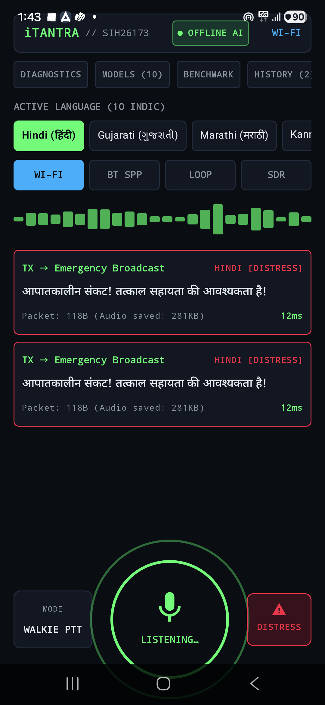
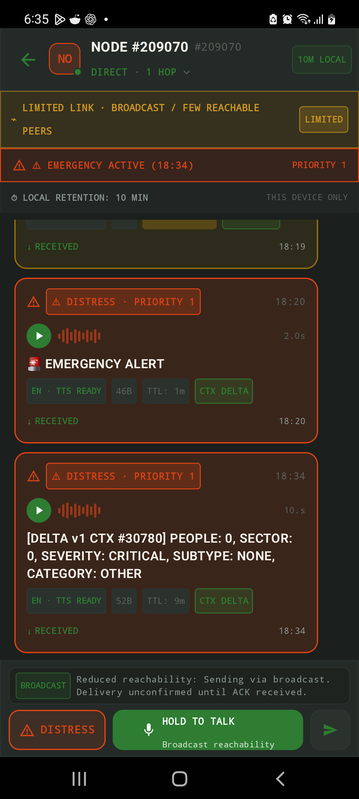
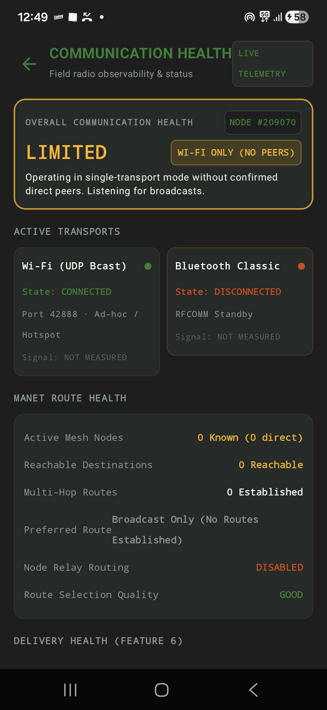
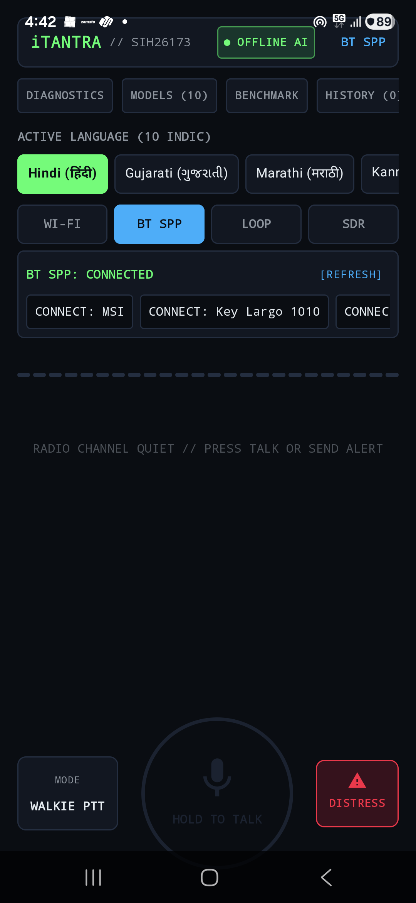
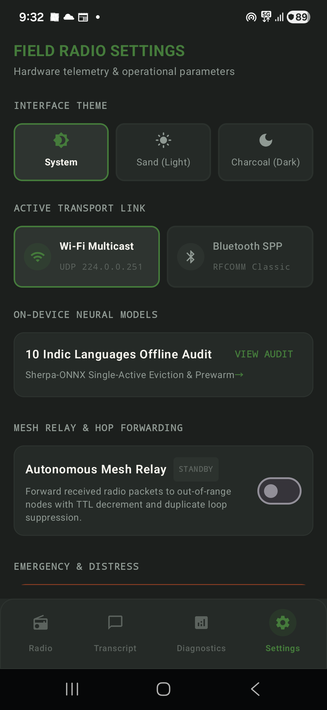

<div align="center">

# AD ASTRA

### iTantra — Offline Multilingual Voice-to-Packet MANET Transceiver

**Smart India Hackathon 2026** • **Problem Statement:** `SIH26173` • **Team:** Ad Astra

[]()
[-blue.svg)]()
[]()
[]()
[](THIRD_PARTY_LICENSES.md)

<br/>



<br/>

**[Architecture](docs/ARCHITECTURE.md)** • **[Protocol Spec](docs/PROTOCOL.md)** • **[Testing Guide](docs/TESTING.md)** • **[Model Setup](docs/MODELS.md)** • **[Third-Party Licenses](THIRD_PARTY_LICENSES.md)** • **[Latest Release](https://github.com/KiranS-create/Ad-Astra/releases/tag/v1.0.0-sih26173)**

</div>

---

## 1. Overview

In disaster zones, remote search-and-rescue operations, and tactical field deployments, cellular networks and cloud connectivity are often damaged or completely nonexistent. Standard walkie-talkies and digital voice streams require high-bandwidth radio channels (~32,000 bytes/sec for raw PCM audio), which suffer from severe packet loss and channel congestion over low-power ad-hoc wireless links.

**iTantra** resolves this bottleneck by implementing an **offline-first neural transceiver architecture**:
1. **On-Device Speech Recognition:** Spoken audio is captured locally and converted to text using an on-device quantized INT8 Whisper model.
2. **Compact Binary Radio Framing:** Transcripts are encoded into compact binary radio packets (38 to 164 bytes) with a fixed 28-byte canonical header, CRC-32 integrity checks, and optional HMAC-SHA256 authentication.
3. **Off-Grid Mesh Routing (MANET & DTN):** Packets travel peer-to-peer over Wi-Fi multicast and Bluetooth SPP links using autonomous multi-hop store-and-forward routing.
4. **Local Neural Voice Reconstruction:** Receiving nodes reconstruct natural audible speech using local neural VITS acoustic models (Piper, Mimic3, Meta MMS) without requiring internet or cloud servers.

---

## 2. Core Architecture

```
  [Speaker's Voice]
         │
         ▼
 ┌───────────────────────────────────────────────────────────┐
 │ 1. Real-Time VAD & Frame Buffering (16 kHz 16-bit PCM)    │
 └─────────────────────────┬─────────────────────────────────┘
                           │
                           ▼
 ┌───────────────────────────────────────────────────────────┐
 │ 2. Streaming Pass 1 STT (Sherpa-ONNX Whisper INT8)        │
 │    + Silence Window Refinement (>= 250ms pauses)          │
 │    + Zero-Wait Release Splicing (< 10ms at PTT release)   │
 └─────────────────────────┬─────────────────────────────────┘
                           │
                           ▼
 ┌───────────────────────────────────────────────────────────┐
 │ 3. Adaptive Representation Engine                         │
 │    [FULL: 90-170B] [COMPACT: 70-110B] [SEMANTIC: 38-48B]  │
 └─────────────────────────┬─────────────────────────────────┘
                           │
                           ▼
 ┌───────────────────────────────────────────────────────────┐
 │ 4. Canonical Radio Framing & Transport                    │
 │    Fixed 28B Header + CRC-32 + Optional HMAC-SHA256       │
 │    Wi-Fi Multicast (Port 42888) & Bluetooth RFCOMM / SPP  │
 └─────────────────────────┬─────────────────────────────────┘
                           │
                           ▼
 ┌───────────────────────────────────────────────────────────┐
 │ 5. Multi-Hop MANET Relay & Local DTN Message Store (Room) │
 └─────────────────────────┬─────────────────────────────────┘
                           │
                           ▼
 ┌───────────────────────────────────────────────────────────┐
 │ 6. Local Neural Speech Synthesis (Piper / Mimic3 / MMS)   │
 └─────────────────────────┬─────────────────────────────────┘
                           │
                           ▼
  [Audible Voice Output to Recipient]
```

*For complete architectural specifications, see [docs/ARCHITECTURE.md](docs/ARCHITECTURE.md).*

---

## 3. Physical Device Interface

The application interface is built with **Jetpack Compose**, designed for rapid high-stress tactical operations:

| 1. Walkie-Talkie & HUD | 2. Tactical Chat & Voice Playback | 3. Technical Packet Inspector |
|:---:|:---:|:---:|
|  |  |  |
| Push-to-Talk HUD with real-time waveform & confidence telemetry | Emergency priority cards, playback controls & delivery markers | Byte-level radio header analysis, hex dump & CRC/HMAC state |

| 4. Network Health & Telemetry | 5. Peer & Mesh Discovery | 6. Radio & Relay Settings |
|:---:|:---:|:---:|
|  |  |  |
| Transport telemetry, packet loss, bandwidth & route graphs | Wi-Fi multicast and Bluetooth SPP peer connectivity states | Autonomous mesh relay toggle, 10 Indic languages & HMAC key |

---

## 4. Key Capabilities & Technical Highlights

### 4.1 Two-Pass Speech Pipeline & Zero-Wait Splicing
- **Continuous Pass 1:** Decodes streaming audio frames as the operator speaks.
- **Selective Pass 2 Refinement:** When natural speech pauses ($\ge 250\text{ ms}$) occur, high-value tokens (emergency codes, numbers, coordinates) are evaluated and refined in the background.
- **Zero-Wait Finalization:** When the Push-to-Talk (PTT) button is released, in-flight background tasks cancel immediately and completed refinements splice into the final transcript, handing the packet to the transmission layer in **$< 10\text{ ms}$**.

### 4.2 Adaptive Representation Wire Footprints
To adapt to varying radio channel qualities, iTantra adjusts message serialization dynamically:

| Mode | Wire Footprint | Savings vs Raw Audio | Primary Use Case |
|---|:---:|:---:|---|
| `FULL_VOICE_TEXT` | 90–170 Bytes | $> 99.5\%$ | Standard conversational speech |
| `COMPACT_VOICE` | 70–110 Bytes | $> 99.7\%$ | Bandwidth-limited links |
| `SEMANTIC_BASE` | 40–48 Bytes | $> 99.8\%$ | Structured tactical commands (8-byte payload) |
| `CONTEXT_DELTA` | 38–46 Bytes | $> 99.85\%$ | Incremental state updates (6–7 byte payload) |

### 4.3 10-Language Multilingual Support
All models execute fully on-device without external cloud connectivity:

| Language | Code | Speech-to-Text (STT) | Text-to-Speech (TTS) Engine |
|---|:---:|---|---|
| **English** | `en` | Whisper-Tiny INT8 | Piper VITS (`en_US-lessac-medium`) |
| **Hindi** | `hi` | Whisper-Tiny INT8 | Piper VITS (`hi_IN-hindi-medium`) |
| **Marathi** | `mr` | Whisper-Tiny INT8 | Piper VITS (`mr_IN-marathi-medium`) |
| **Malayalam** | `ml` | Whisper-Tiny INT8 | Piper VITS (`ml_IN-malayalam-medium`) |
| **Telugu** | `te` | Whisper-Tiny INT8 | Piper VITS (`te_IN-telugu-medium`) |
| **Bengali** | `bn` | Whisper-Tiny INT8 | Piper VITS (`bn_IN-bengali-medium`) |
| **Gujarati** | `gu` | Whisper-Tiny INT8 | Mimic3 VITS (`gu_IN-cpc_female-low`) |
| **Kannada** | `kn` | Whisper-Tiny INT8 | Meta MMS VITS / System TTS Fallback |
| **Tamil** | `ta` | Whisper-Tiny INT8 | Meta MMS VITS / System TTS Fallback |
| **Odia** | `or` | Whisper-Tiny INT8 | Meta MMS VITS / System TTS Fallback |

---

## 5. Quick Start & Build Guide

### Prerequisites
- **Android Studio Ladybug (2024.2+)** or IntelliJ IDEA with Android plugin
- **JDK 17** (configured via `JAVA_HOME`)
- **Android SDK API 34** with Build Tools `34.0.0`
- Physical Android device running **Android 10+ (API 29+)** with ARM64 architecture

### 1. Clone the Repository
```bash
git clone https://github.com/KiranS-create/Ad-Astra.git
cd Ad-Astra
```

### 2. Run Automated Unit Tests
```bash
# Windows
.\gradlew.bat testDebugUnitTest

# Linux / macOS
./gradlew testDebugUnitTest
```
*All 678+ unit tests will execute and verify protocol framing, speech splicing, representation encoding, and mesh routing.*

### 3. Build & Install Debug APK
```bash
# Build the APK
.\gradlew.bat assembleDebug

# Install to connected device via ADB
adb install -r app/build/outputs/apk/debug/app-debug.apk
```

### 4. Pre-Built APK Download
A complete pre-built release containing all bundled model assets is available on GitHub Releases:
- **[Download v1.0.0-sih26173 (app-debug.apk)](https://github.com/KiranS-create/Ad-Astra/releases/tag/v1.0.0-sih26173)**

---

## 6. Physical Verification Setup

The project has been physically validated across two ARM64 Android smartphones in an off-grid environment:
- **Device A:** Samsung Galaxy Note 10 Lite (Android 13, Exynos 9810, 6 GB RAM)
- **Device B:** Samsung Galaxy A55 5G (Android 14, Exynos 1480, 8 GB RAM)

**Verified Behaviors:**
- [x] Push-to-Talk speech recognition to packet transmission in $< 10\text{ ms}$ after release.
- [x] Wi-Fi UDP multicast packet delivery over ad-hoc local hotspots without internet access.
- [x] Bluetooth Classic SPP serial transmission between paired devices.
- [x] Multi-hop mesh relay forwarding with loop suppression and TTL decrement.
- [x] Offline neural voice synthesis on receiving handset across 9 Indian languages + English.

*For complete test procedures and logs, refer to [docs/TESTING.md](docs/TESTING.md).*

---

## 7. Project Documentation

- **[System Architecture](docs/ARCHITECTURE.md):** Deep dive into the 6-layer neural transceiver stack.
- **[Protocol Specification](docs/PROTOCOL.md):** 28-byte canonical header layout, message types, CRC32, HMAC, and DTN state machines.
- **[Testing Methodology](docs/TESTING.md):** Unit test suite organization, physical device testbed, and test scenarios.
- **[Model Setup & Management](docs/MODELS.md):** Model quantization details, storage layout, and MMS fallback guidelines.
- **[Third-Party Licenses](THIRD_PARTY_LICENSES.md):** Open-source licensing notices for runtime engines, libraries, and model weights.
- **[Security Policy](SECURITY.md):** Threat model, HMAC authentication boundaries, and vulnerability disclosure.

---

## 8. Team & Hackathon Information

- **Competition:** Smart India Hackathon 2026
- **Problem Statement ID:** `SIH26173`
- **Team Name:** Ad Astra
- **Project Name:** iTantra

---

## 9. License & Citations

The software and protocol implementations in this repository are licensed under the **MIT License** (see [THIRD_PARTY_LICENSES.md](THIRD_PARTY_LICENSES.md) for third-party library and neural model licenses).

If you use or reference this work, please cite it using [CITATION.cff](CITATION.cff).
