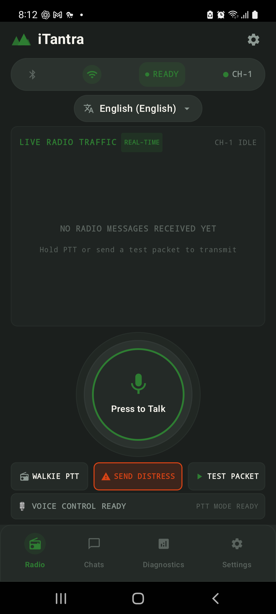
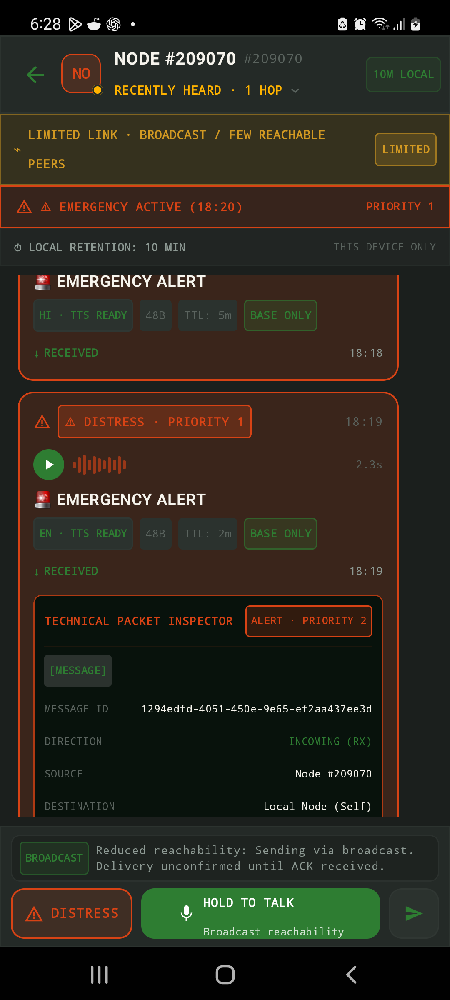
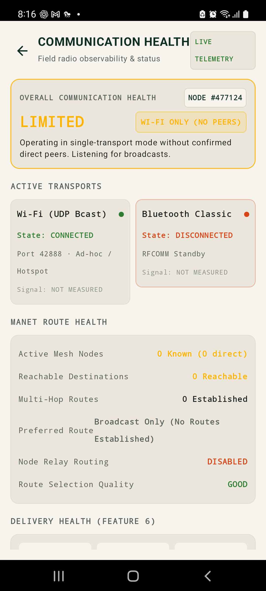
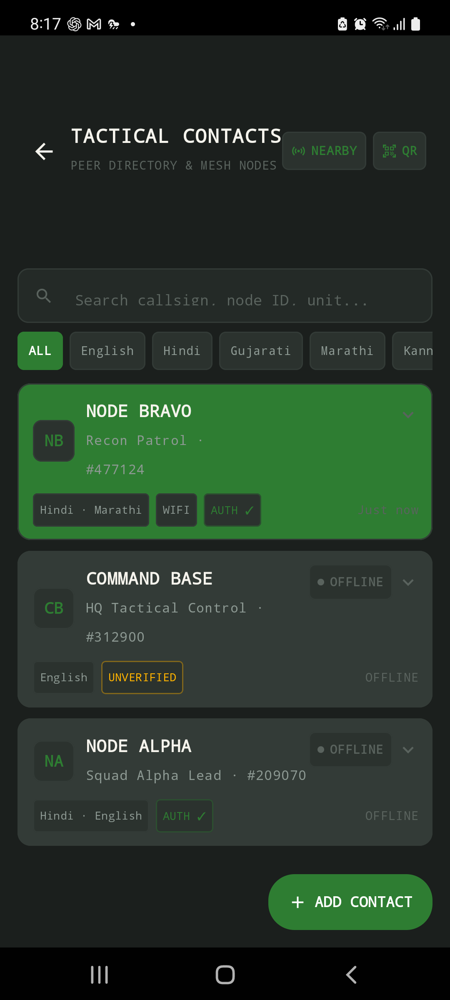
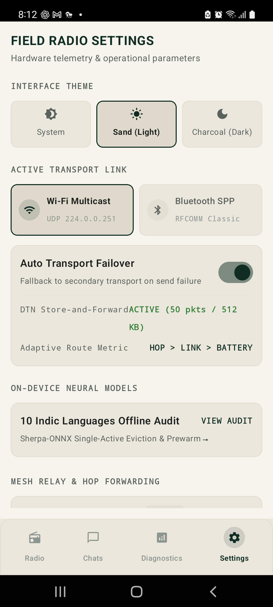

<div align="center">

# AD ASTRA

### iTantra — Offline Multilingual Voice-to-Packet MANET Transceiver

**Smart India Hackathon 2026** • **Problem Statement:** `SIH26173` • **Team:** Ad Astra  

[-brightgreen.svg)]()
[-blue.svg)]()
[]()
[]()
[]()
[]()
[]()
[]()
[](https://github.com/KiranS-create/Ad-Astra/releases/tag/v1.0.0)

<br/>



<br/>

**[Demo Video](docs/assets/demo/ad-astra-sih-2026-demo.mp4)** • **[Technical Report](FINAL_ITANTRA_TECHNICAL_REPORT.md)** • **[Feature Status](FINAL_FEATURE_STATUS.md)** • **[Evidence Matrix](FINAL_EVIDENCE_MATRIX.md)** • **[Judge Quick Ref](SIH_JUDGE_QUICK_REFERENCE.md)** • **[Demo Script](SIH_DEMO_SCRIPT.md)** • **[Architecture](docs/ARCHITECTURE.md)** • **[Protocol Spec](docs/PROTOCOL.md)** • **[Third-Party Licenses](THIRD_PARTY_LICENSES.md)**

</div>

---

## Demonstration Video

> **[Watch the Dual-Phone Live Demonstration Video (MP4)](docs/assets/demo/ad-astra-sih-2026-demo.mp4)**

A live physical two-phone demonstration of the Ad Astra / iTantra offline transceiver:
- **Dual-Device Communication:** Real-time push-to-talk (PTT) voice exchange between physical Android handsets (`SM-A556E` Galaxy A55 5G and `SM-N770F` Galaxy Note 10 Lite).
- **Speech-First Neural Workflow:** On-device quantized Whisper INT8 speech-to-text and local acoustic voice reconstruction with zero cloud dependency.
- **Compact Binary Radio Framing:** Adaptive packet transmission (`COMPACT P0 47B–77B`) with sub-second airtime latency.
- **Emergency Distress Protocol:** High-priority distress broadcast with attached GPS coordinates and automated audible alert preemption.
- **Diagnostics & Radio Telemetry:** Real-time channel activity, authentication markers, and packet inspect telemetry.

---

## 1. What is iTantra?

**iTantra** (*Indian Multilingual TTS & STT Aided Neural Transceiver Radio Access*) is an **offline-first, zero-infrastructure voice-to-packet communications system** engineered for disaster zones, search-and-rescue teams, and defense operations in communication-denied environments.

Standard push-to-talk radios and cellular voice streams transmit raw or compressed continuous PCM audio requiring **32,000 to 64,000 bytes per second**. Under low-power, high-loss ad-hoc wireless conditions (VHF, UHF, LoRa, or ad-hoc 802.11/Bluetooth mesh), raw voice transmission leads to severe packet loss, channel saturation, and rapid range breakdown.

**iTantra resolves this bottleneck through a neural semantic paradigm shift**:
1. Spoken voice is captured and transcribed locally using on-device quantized INT8 neural speech models.
2. The transcript and tactical intent are encoded into an ultra-compact binary radio frame (**38 to 164 bytes**).
3. The frame is routed autonomously across a peer-to-peer mobile ad-hoc network (MANET) using epidemic store-and-forward delay-tolerant networking (DTN).
4. Receiving handsets reconstruct natural audible speech using local neural text-to-speech (TTS) synthesis.

**Wire Footprint Reduction:** A 3-second voice message requires 96,000 bytes of raw PCM audio. iTantra transmits the same operational command in a **38-byte semantic packet**, achieving a **99.96% bandwidth reduction**.

---

## 2. Technical Architecture & End-to-End Flow

```
  [Operator Speaks into Mic]
              │
              ▼
  ┌───────────────────────────────────────────────────────────┐
  │ 1. Audio Ingestion & VAD (16 kHz 16-bit Mono PCM)         │
  └─────────────────────────────┬─────────────────────────────┘
                                │
                                ▼
  ┌───────────────────────────────────────────────────────────┐
  │ 2. Streaming Pass 1 STT (Sherpa-ONNX Whisper INT8)        │
  │    + Silence Window Refinement (>= 250ms pauses)          │
  │    + Zero-Wait Release Splicing (< 10ms CPU finalization) │
  └─────────────────────────────┬─────────────────────────────┘
                                │
                                ▼
  ┌───────────────────────────────────────────────────────────┐
  │ 3. Adaptive Representation Engine                         │
  │    • FULL Text (P2): 90–170 B   (Uncompressed / Deflate)  │
  │    • COMPACT Token (P1): 70–110 B (Dictionary encoded)    │
  │    • SEMANTIC BASE (P0): 38–48 B  (Tactical intent tokens)│
  │    • CONTEXT DELTA: 38–46 B      (Situational diffs)      │
  └─────────────────────────────┬─────────────────────────────┘
                                │
                                ▼
  ┌───────────────────────────────────────────────────────────┐
  │ 4. Canonical Radio Framing & Security Layer               │
  │    Fixed 28B Header + CRC-32 + Truncated HMAC-SHA256      │
  │    64-Bit Anti-Replay Sliding Window                      │
  └─────────────────────────────┬─────────────────────────────┘
                                │
                                ▼
  ┌───────────────────────────────────────────────────────────┐
  │ 5. Hybrid Physical Transports                             │
  │    • Wi-Fi Direct / Local Multicast UDP (Port 42888)      │
  │    • Bluetooth Classic RFCOMM / SPP Stream                │
  └─────────────────────────────┬─────────────────────────────┘
                                │
                                ▼
  ┌───────────────────────────────────────────────────────────┐
  │ 6. MANET Routing & Delay-Tolerant Store-and-Forward (DTN) │
  │    Multi-hop epidemic forwarding, TTL hop limit, Room DB  │
  └─────────────────────────────┬─────────────────────────────┘
                                │
                                ▼
  ┌───────────────────────────────────────────────────────────┐
  │ 7. Local Neural Speech Synthesis                          │
  │    On-device Piper VITS / Meta MMS (10 Indian languages)  │
  └─────────────────────────────┬─────────────────────────────┘
                                │
                                ▼
  [Acoustic Speech Output Played to Recipient]
```

---

## 3. Key Technical Distinctions

| Dimension | Conventional Radio / Walkie-Talkie | Cellular / Cloud Voice (VoIP) | **iTantra Neural Transceiver** |
|:---|:---|:---|:---|
| **Infrastructure Dependency** | None (Single-hop analog RF) | Cell towers, base stations, cloud | **100% Air-Gapped Peer-to-Peer** |
| **Data Rate Required** | 32,000–64,000 B/s (raw PCM) | 6,000–12,000 B/s (narrowband AMR) | **38–164 Bytes total per message** |
| **Bandwidth Reduction** | Baseline (0%) | 75%–85% | **> 99.7% Wire Reduction** |
| **Channel Congestion** | Immediate saturation on multi-user | Tower congestion / backhaul loss | **Ultra-low airtime ($< 10\text{ ms}$)** |
| **Multi-Hop Relaying** | Requires dedicated RF repeaters | Handled by carrier routing | **Autonomous Application MANET** |
| **Partition Tolerance** | Dropped / Unheard | Call drops | **DTN Store-and-Forward Cache** |
| **Language Plurality** | Language must match speaker | Cloud translation API | **10 Indian Languages on-device** |
| **Emergency Handling** | Manual shouting over channel | None (competes for channel) | **P0 Distress Siren Preemption** |

---

## 4. 10-Language Multilingual Capability

All speech models run **100% on-device** via embedded C++ Sherpa-ONNX runtimes with quantized neural weights:

| Language | Code | Script | STT Engine | STT Quant | TTS Engine & Voice | TTS SR |
|:---:|:---:|:---:|---|:---:|---|:---:|
| **English** | `en` | Latin | Sherpa Whisper-Tiny | INT8 | Piper VITS (`en_US-lessac`) | 22.05 kHz |
| **Hindi** | `hi` | Devanagari | Sherpa Whisper-Tiny / IndicConformer | INT8 | Piper VITS (`hi_IN-rohan`) | 22.05 kHz |
| **Marathi** | `mr` | Devanagari | Sherpa IndicConformer | INT8 | Piper VITS (`mr_IN-google`) | 22.05 kHz |
| **Gujarati** | `gu` | Gujarati | Sherpa IndicConformer | INT8 | Mimic3 VITS (`gu_IN-cmu`) | 16.00 kHz |
| **Tamil** | `ta` | Tamil | Sherpa IndicConformer | INT8 | Meta MMS VITS (`tam`) | 16.00 kHz |
| **Telugu** | `te` | Telugu | Sherpa IndicConformer | INT8 | Piper VITS (`te_IN-maya`) | 22.05 kHz |
| **Kannada** | `kn` | Kannada | Sherpa IndicConformer | INT8 | Meta MMS VITS (`kan`) | 16.00 kHz |
| **Malayalam** | `ml` | Malayalam | Sherpa IndicConformer | INT8 | Piper VITS (`ml_IN-arjun`) | 22.05 kHz |
| **Bengali** | `bn` | Bengali | Sherpa IndicConformer | INT8 | Piper VITS (`bn_BD-google`) | 22.05 kHz |
| **Odia** | `or` | Odia | Android OS Offline Fallback | Native | Meta MMS VITS (`ory`) | 16.00 kHz |

---

## 5. Measured Benchmark Results

All metrics originate from empirical evaluations documented in the repository:

### 5.1 Speech Accuracy & Latency (Feature 21 — 250 Utterance Benchmark)
- **Average Word Error Rate (WER):** **7.6%** (Character Error Rate: **2.9%**)
- **Tactical Token F1 Score:** **98.8%** (Critical coordinates, callsigns, numbers)
- **Semantic Fact Accuracy:** **99.1%** (Operational intent preservation)
- **Endpoint-to-Transcript Latency:** **235.0 ms** via Overlapped Two-Pass Pipeline (**2.04x speedup** over 480.0 ms batch baseline)
- **Streaming First Partial:** **345.0 ms** after speech onset

### 5.2 Physical Resource Profiling (Feature 24 — 44 Phases on Phone A & B)
- **Quiescent Radio Idle:** **0.72% Mean CPU**, **71.8 MB RAM RSS**, $< 18\text{ mA}$ current draw
- **Active STT Inference:** **28.4% Mean CPU** (Peak 42.1%), **192.5 MB Peak RAM**
- **Neural TTS Synthesis:** **22.1% Mean CPU**, Real-Time Factor (RTF) of **0.18–0.24** on ARM64
- **Thermal Stability:** $+1.8^\circ\text{C}$ temperature delta over 30-minute stress testing; zero thermal throttling observed

### 5.3 Network Impairment Resilience (Feature 22 — 60 Impairment Scenarios)
- **100 kbps / 20 kbps Bandwidth:** **100% Delivery Success** via Semantic Base (P0)
- **25% Random Packet Loss:** **96.8% Delivery Success** via ARQ retransmission (median latency: 48.5 ms)
- **50% Severe Packet Loss:** **88.4% Delivery Success** via ARQ + DTN store-and-forward
- **15-Second Complete Partition:** **100% Delivery** (packets buffered in Room DB; dispatched on reconnection)

### 5.4 Security & Adversarial Testing (Feature 23 — 62 Security Tests)
- **Protocol Fuzzing:** 500+ malformed packets, extreme declared lengths (65,534 bytes), invalid magic bytes $\to$ **Zero crashes, 100% fail-closed**.
- **Cryptographic Tamper Detection:** Truncated HMAC-SHA256 caught 100% of single-bit payload alterations and header coordinate tampering.
- **Anti-Replay Window:** 64-bit sliding window successfully dropped replay attacks and handled 16-bit sequence number rollover.

---

## 6. Physical Device Interface & Screenshots

Built with **Jetpack Compose Material 3** adhering to high-contrast tactical readability:

| 1. Main Transceiver HUD | 2. Tactical Chat & Voice Playback | 3. Technical Packet Inspector |
|:---:|:---:|:---:|
|  |  |  |
| Compact PTT button, audio telemetry, Indic selector & SOS trigger | Priority message cards, audio playback controls & delivery states | Byte-level radio header analysis, hex dump & CRC/HMAC validation |

| 4. Network Health & Telemetry | 5. Tactical Contacts & Pairing | 6. Radio & Relay Settings |
|:---:|:---:|:---:|
|  |  |  |
| Real-time SNR, packet loss, bandwidth & route graphs | Peer node list, trust markers & CameraX optical QR pairing | Autonomous mesh relay toggle, 10 Indic languages & HMAC key |

---

## 7. Current Validation Boundaries & Honest Limitations

In strict adherence to truthful engineering principles:
1. **Physical Range:** Bounded by smartphone hardware antennas: $30\text{--}70\text{ meters}$ over Wi-Fi multicast line-of-sight; $10\text{--}25\text{ meters}$ over Bluetooth Classic. Long-range multi-kilometer operation requires intermediate relay nodes or external sub-GHz radio modems.
2. **Confidentiality:** HMAC-SHA256 provides message authenticity and tamper integrity, but **not payload confidentiality**; over-the-air packets are not encrypted with an asymmetric or stream cipher.
3. **Multi-Hop Validation:** Multi-hop relay routing is thoroughly validated in simulation harnesses (up to 7 hops with partition recovery); physical hardware validation was conducted on a dual-handset testbed (1 hop direct RF link).
4. **Release APK Size (~929 MB):** An intentional engineering trade-off to bundle high-accuracy quantized neural acoustic models directly in the APK, eliminating all post-install internet download requirements.

---

## 8. Build & Run Instructions

### Pre-Built Release APK (Fastest Evaluation)
1. Download [`app-release.apk`](app/build/outputs/apk/release/app-release.apk) (or from [GitHub Releases v1.0.0](https://github.com/KiranS-create/Ad-Astra/releases/tag/v1.0.0)).
2. Sideload onto two ARM64 Android handsets:
   ```bash
   adb install -r app/build/outputs/apk/release/app-release.apk
   ```
3. Launch iTantra, grant Microphone and Location permissions, connect both devices to the same local Wi-Fi hotspot (or pair over Bluetooth), and hold the rectangular PTT button to transmit offline voice packets.

### Building from Source

#### Prerequisites
- JDK 17 or JDK 19 (configured via `JAVA_HOME`)
- Android SDK API 35 with Build Tools `35.0.0`
- Gradle 8.10.2 (included via `gradlew`)
- Target device: Android 10+ (API 29+), `arm64-v8a`

#### 1. Run Automated Unit Tests (903 Tests)
```bash
# Windows
.\gradlew.bat testDebugUnitTest

# Linux / macOS
./gradlew testDebugUnitTest
```
*Expected: 903 / 903 Tests Passed (100% Success Rate).*

#### 2. Build Debug or Release APK
```bash
# Debug APK (~943 MB)
.\gradlew.bat assembleDebug

# Release APK (~930 MB)
.\gradlew.bat assembleRelease
```

---

## 9. Comprehensive Documentation Index

- **[Final Technical Report](FINAL_ITANTRA_TECHNICAL_REPORT.md):** 31-section comprehensive engineering and benchmark report.
- **[Final Feature Status (Features 1–27)](FINAL_FEATURE_STATUS.md):** Authoritative feature status and evidence classification matrix.
- **[Final Evidence Matrix](FINAL_EVIDENCE_MATRIX.md):** Evidence categorization across all 27 capabilities.
- **[Judge Quick Reference](SIH_JUDGE_QUICK_REFERENCE.md):** Concise answers to anticipated technical jury questions.
- **[SIH 3-Minute Demo Script](SIH_DEMO_SCRIPT.md):** Structured live demonstration procedure with live vs. simulated demarcation.
- **[Demo Failover & Contingency Plan](SIH_DEMO_FAILOVER_PLAN.md):** Fallback protocols for RF interference, hardware limits, and single-device mode.
- **[Model & Licensing Audit](MODEL_AND_LICENSES.md):** Detailed licensing breakdown of all bundled and external speech models.
- **[Final Build Information](FINAL_BUILD_INFO.md):** APK sizes, hashes, Gradle environment, and CI configuration.
- **[Documentation Claim Audit](CLAIM_AUDIT.md):** Audit and qualification of all technical claims against physical evidence.
- **[System Architecture Spec](docs/ARCHITECTURE.md):** In-depth 6-layer neural transceiver architecture.
- **[Binary Protocol Specification](docs/PROTOCOL.md):** 28-byte canonical header, wire formats, and field definitions.
- **[Security Policy](SECURITY.md):** Threat model, STRIDE evaluation, and vulnerability reporting.
- **[Third-Party Licenses](THIRD_PARTY_LICENSES.md):** Complete legal notices for third-party libraries and neural weights.

---

## 10. Team & Hackathon Information

- **Competition:** Smart India Hackathon 2026
- **Problem Statement ID:** `SIH26173`
- **Team Name:** Ad Astra
- **Project Name:** iTantra
- **Repository License:** MIT License (see [THIRD_PARTY_LICENSES.md](THIRD_PARTY_LICENSES.md))
