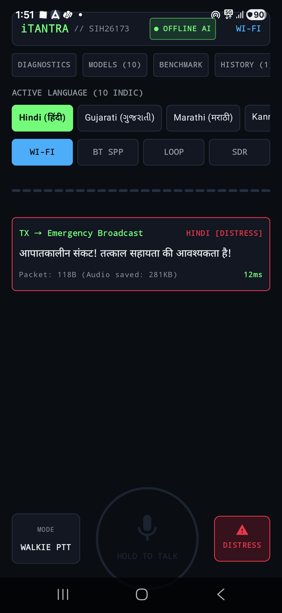
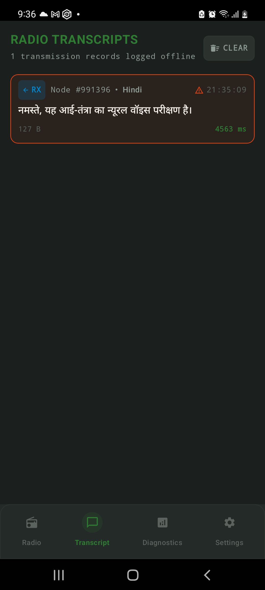
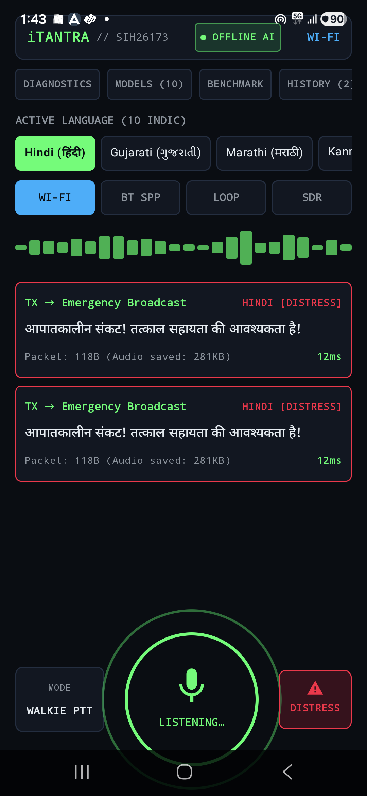
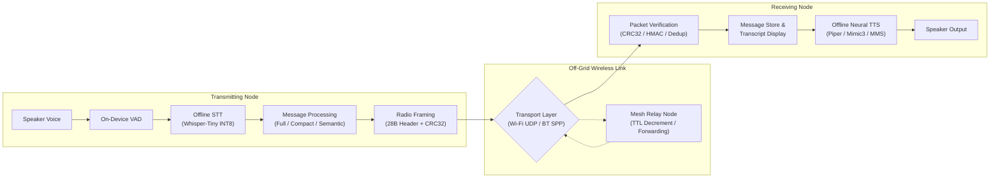
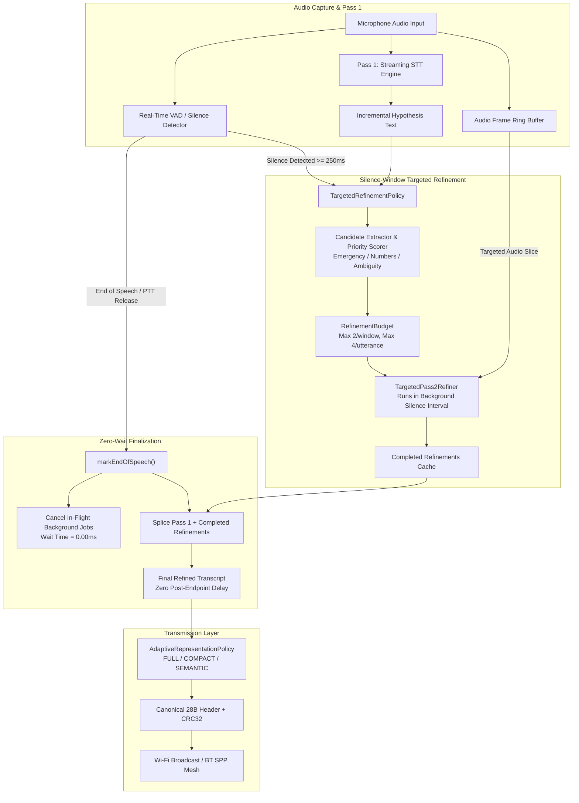

<div align="center">

# AD ASTRA

### iTantra — Offline Multilingual Voice Communication

**Smart India Hackathon 2026 • SIH26173**

[](https://kotlinlang.org)
[](https://developer.android.com/jetpack/compose)
[-3DDC84.svg?style=flat-square&logo=android)](https://www.android.com)
[](https://onnxruntime.ai)
[](#)
[](#supported-languages)
[](#)
[](#)

<p align="center">
  <em>Voice communication that works without internet or cellular infrastructure, using on-device speech processing and phone-to-phone networking.</em>
</p>

---

### Project Snapshot

| 10 | 3 | 2 | 0 |
| :---: | :---: | :---: | :---: |
| **Languages** | **Transports** | **Phone Demo** | **Cloud Speech Dependency** |
| Multilingual STT & TTS | Wi-Fi UDP, BT SPP, Loopback | Verified Point-to-Point | Zero Remote API Calls |

</div>

> **Transport Layer Note:** Off-grid communication operates over implemented Wi-Fi UDP broadcast (port 42888) and Bluetooth RFCOMM/SPP paths, with Bluetooth discovery utilized where supported. No internet connection or cellular carrier signal is used.

---

## Demo Gallery

| Walkie-Talkie | Mesh Link | Messages | Emergency SOS | Diagnostics |
| :---: | :---: | :---: | :---: | :---: |
|  |  |  |  |  |
| **Push-to-Talk**<br/>Voice interaction & waveform | **Peer Discovery**<br/>Bluetooth SPP & Wi-Fi mesh link | **Message History**<br/>Stored voice & text transcripts | **Emergency SOS**<br/>Priority distress broadcast | **Field Parameters**<br/>Radio & autonomous relay |

---

## What It Does

In tactical operations, disaster relief, and off-grid remote zones, cellular towers and internet backbones are frequently unavailable or damaged. Conventional voice systems attempt to stream raw audio, which quickly congests narrow radio channels.

**iTantra** takes a different approach:
- **Captures voice locally:** Uses on-device Voice Activity Detection (VAD) and a quantized multilingual speech recognizer to transcribe spoken words directly on the phone.
- **Compresses to radio packets:** Converts transcripts and tactical intents into compact binary packets (46 to 170 bytes), achieving orders-of-magnitude smaller payloads than raw audio.
- **Transmits phone-to-phone:** Transmits packets over direct peer-to-peer radio channels (Wi-Fi UDP multicast or Bluetooth SPP) without cell towers, SIM cards, or central servers.
- **Relays across the mesh:** Multi-hop forwarding logic decrements packet TTL and suppresses duplicate transmissions to reach out-of-range nodes.
- **Synthesizes voice on receiver:** The receiving phone reconstructs intelligible speech in the recipient's chosen Indian language using an on-device neural Text-to-Speech engine.
- **Prioritizes emergency distress:** High-priority SOS alerts bypass normal queuing, transmit in under 40 bytes, and trigger immediate acoustic alarms on nearby devices.

---

## Key Capabilities

| Capability | Technical Implementation |
|---|---|
| **Offline Multilingual STT** | On-device Whisper-Tiny INT8 quantized acoustic model running via Sherpa-ONNX; zero cloud calls. |
| **Language-Aware Neural TTS** | On-device voice synthesis across 10 languages using lightweight Piper VITS, Mimic3, and Meta MMS models. |
| **Two-Pass Pipelined Speech** | Pass-1 streaming hypothesis classification during speech pauses, followed by instant (<10ms) finalization on PTT release. |
| **Adaptive Message Representation** | Dynamic selection between FULL text, COMPACT text, SEMANTIC base commands, and 6–7 byte situational context deltas. |
| **Multi-Hop + DTN Forwarding** | Store-and-forward mesh routing with TTL decrement, bloom-filter duplicate suppression, and peer discovery. |
| **Reliable Framing & Wire Integrity** | Canonical 28-byte framing, CRC-32 wire error detection, optional HMAC-SHA256 authentication, and automatic packet fragmentation/reassembly. |
| **Emergency Priority & Diagnostics** | Dedicated one-tap SOS broadcast path (< 40 bytes) with immediate acoustic alarm, alongside real-time transport telemetry and message tracking. |

---

## How It Works



### Two-Pass Processing Pipeline

To minimize latency on mobile chipsets, the speech engine does not wait for speech to finish before beginning processing:
1. **Pass 1 (During Speech):** Streaming acoustic analysis extracts candidate tokens and preliminary intent while the operator is speaking.
2. **Silence Windows (During Natural Pauses):** If the speaker pauses for $\ge 250\text{ ms}$, background refinement runs on high-value tokens (emergency keywords, numbers, grid coordinates).
3. **PTT Release (Zero-Wait Finalization):** When the operator releases the button, in-flight background jobs cancel immediately, completed refinements splice into the transcript, and the packet transmits in $< 10\text{ ms}$.

---

## Architecture

The following diagram illustrates the internal component boundaries from microphone input to mesh transport:



---

## Tech Stack

| Domain | Technology | Implementation Detail |
|---|---|---|
| **Language** | Kotlin 2.0.21 | 100% Kotlin coroutines, flows, and structured concurrency |
| **User Interface** | Jetpack Compose (Material 3) | Tactical dark HUD theme, dynamic waveform visualizer, accessibility support |
| **Architecture** | Clean Architecture / MVI | Domain, Core, Data, and Presentation separation with unidirectional state flow |
| **Persistence** | Room (SQLite) + Datastore | Encrypted local message store, delivery states, contacts, and preferences |
| **Speech-to-Text** | Whisper-Tiny (Quantized INT8) | On-device ONNX Runtime acoustic inference via Sherpa-ONNX |
| **Voice Activity Detection** | Energy + Zero-Crossing Rate VAD | Real-time speech boundary detection and silence-interval tracking |
| **Text-to-Speech** | VITS Piper, Mimic3, Meta MMS | On-device ONNX neural acoustic models for natural voice playback |
| **Networking** | Wi-Fi UDP & Bluetooth SPP | UDP Multicast (port 42888), RFCOMM Classic, BLE advertising/scanning |
| **Runtime / Inference** | ONNX Runtime (Sherpa-ONNX) | Native C++ binaries compiled for `arm64-v8a` and `armeabi-v7a` |
| **Android SDK** | Min SDK 26 / Target SDK 35 | Android 8.0 (Oreo) through Android 15 |

---

## Supported Languages

iTantra provides verified offline Speech-to-Text and Text-to-Speech support across 10 Indian languages:

| Language | ISO Code | Script | Offline STT Engine | Offline TTS Engine |
|---|:---:|---|---|---|
| **Hindi** | `hi` | Devanagari | Whisper-Tiny INT8 | VITS Piper (Rohan Medium) |
| **English** | `en` | Latin | Whisper-Tiny INT8 | VITS Piper (Lessac Medium) |
| **Gujarati** | `gu` | Gujarati | Whisper-Tiny INT8 | VITS Mimic3 (CMU Indic Low) |
| **Marathi** | `mr` | Devanagari | Whisper-Tiny INT8 | VITS Piper (Google Medium) |
| **Kannada** | `kn` | Kannada | Whisper-Tiny INT8 | VITS Meta MMS Kannada\* |
| **Malayalam** | `ml` | Malayalam | Whisper-Tiny INT8 | VITS Piper (Arjun Medium) |
| **Tamil** | `ta` | Tamil | Whisper-Tiny INT8 | VITS Meta MMS Tamil\* |
| **Telugu** | `te` | Telugu | Whisper-Tiny INT8 | VITS Piper (Maya Medium) |
| **Odia** | `or` | Odia | Android OS Voice Pack Fallback | VITS Meta MMS Odia\* |
| **Bengali** | `bn` | Bengali | Whisper-Tiny INT8 | VITS Piper (Google Medium) |

*\*Note on MMS Models: Kannada, Tamil, and Odia MMS voice models (~114 MB each) exceed GitHub's 100 MB hosting limit and are distributed separately. If omitted during a custom build, the app automatically falls back to the device's native Android offline TTS engine without crashing. See [docs/MODELS.md](docs/MODELS.md) for details.*

---

## Run the Demo

### Fastest Way to Test

1. **Download the pre-built demo APK:**  
   [**Download `app-debug.apk` (934 MB)**](https://github.com/KiranS-create/Ad-Astra/releases/download/v1.0.0-sih26173/app-debug.apk)  
   *(Also available on the [v1.0.0-sih26173 Release Page](https://github.com/KiranS-create/Ad-Astra/releases/tag/v1.0.0-sih26173))*

2. **Install on an Android device** (Android 8.0 / API 26 or higher):
   ```bash
   adb install -r app-debug.apk
   ```
   *Or download directly to your phone browser and open with the Android file manager.*

3. **Grant permissions** when prompted:
   - Microphone (for local speech capture)
   - Nearby Devices / Bluetooth (for SPP pairing & discovery)
   - Wi-Fi / Local Network (for multicast lock & broadcast socket)

4. **Two-Phone Field Test:**
   - **Wi-Fi Mode (Recommended):** Turn on Wi-Fi Hotspot on Phone A (mobile data is **not** required). Connect Phone B to Phone A's hotspot. Open iTantra on both phones and set Transport to **WI-FI**. Select your language, hold **HOLD TO TALK**, speak, and release. Phone B receives the packet and speaks the audio aloud.
   - **Bluetooth Mode:** Pair Phone A and Phone B in Android Bluetooth settings. In iTantra, switch Transport to **BT SPP**, connect to the peer, and transmit.
   - **Single-Phone Loopback:** Switch Transport to **LOOP** to verify speech recognition, framing, and TTS playback on a single device.

---

## Building from Source

### Prerequisites
- **Android Studio:** Ladybug (2024.2) or newer
- **JDK:** Version 17 or Version 19
- **Android SDK:** Platform `android-35`, Build Tools `35.0.0`
- **Gradle:** 8.10.2 (wrapper included)

### 1. Model Setup
All sub-100 MB neural models are pre-packaged in the repository under `app/src/main/assets/models/`. If you want to include offline neural TTS for Kannada, Tamil, or Odia, download the corresponding `.onnx` files as detailed in **[docs/MODELS.md](docs/MODELS.md)**. If omitted, the app will compile cleanly and fall back to system TTS for those three languages.

### 2. Run Test Suite
```bash
./gradlew testDebugUnitTest
```

### 3. Assemble Debug APK
```bash
./gradlew assembleDebug
```
The installable APK will be generated at:  
`app/build/outputs/apk/debug/app-debug.apk`

---

## Model Setup & Distribution

To comply with GitHub's 100 MB per-file hosting policy while providing zero-configuration evaluation:
- **In-Repo Models:** Whisper-Tiny INT8 STT and 7 Piper/Mimic3 TTS models are version-controlled in `app/src/main/assets/models/`.
- **Separately Distributed Models:** Kannada, Tamil, and Odia VITS-MMS models (~114 MB each) can be placed in `app/src/main/assets/models/tts/` prior to building.
- **Pre-Built Release APK:** The release APK on GitHub Releases bundles the complete model suite into the installable package.

For detailed model origins, licenses, token mappings, and download instructions, see **[docs/MODELS.md](docs/MODELS.md)**.

---

## Current Prototype Limitations

In the interest of engineering transparency, the current prototype has the following operational constraints:
1. **Hardware Compute Variation:** On-device neural STT and TTS inference latency depends on device CPU/NPU capabilities. Mid-range to flagship devices (e.g., Exynos 1480, Snapdragon 778G+) achieve sub-200ms processing, while entry-level processors require longer inference times.
2. **RF Propagation Range:** Without external SDR or dedicated VHF/UHF hardware modules, communication distance is limited by consumer smartphone Wi-Fi and Bluetooth antennas (typically 10 to 80 meters unobstructed line-of-sight).
3. **Acoustic Background Noise:** Local VAD and acoustic decoding accuracy depend on microphone hardware and physical proximity in noisy environments; a headset or close mic placement is recommended during high ambient noise.
4. **Storage Footprint:** Packaging comprehensive offline neural models for 10 languages requires ~600 MB of on-device storage.

---

## Team & Hackathon Information

<div align="center">

### Ad Astra
**Smart India Hackathon 2026**  
**Problem Statement:** SIH26173  

</div>

---

## License & Third-Party Assets

- **Repository Source Code:** Developed by Team Ad Astra for Smart India Hackathon 2026.
- **Third-Party Model Weights & Runtimes:** Speech models and inference libraries utilized by this project are subject to their respective upstream licenses:
  - **Whisper-Tiny:** MIT License ([OpenAI / k2-fsa](https://github.com/k2-fsa/sherpa-onnx))
  - **Piper TTS Voices:** MIT / Apache-2.0 ([rhasspy/piper-voices](https://github.com/rhasspy/piper-voices))
  - **Mimic3 TTS Voices:** Open Source ([MycroftAI/mimic3-voices](https://github.com/MycroftAI/mimic3-voices))
  - **Meta MMS TTS Models:** CC-BY-NC 4.0 ([Meta AI / willwade](https://huggingface.co/willwade/mms-tts-multilingual-models-onnx))
  - **Sherpa-ONNX / ONNX Runtime:** Apache-2.0 / MIT ([k2-fsa/sherpa-onnx](https://github.com/k2-fsa/sherpa-onnx))

For comprehensive licensing details and model documentation, refer to **[docs/MODELS.md](docs/MODELS.md)**.
