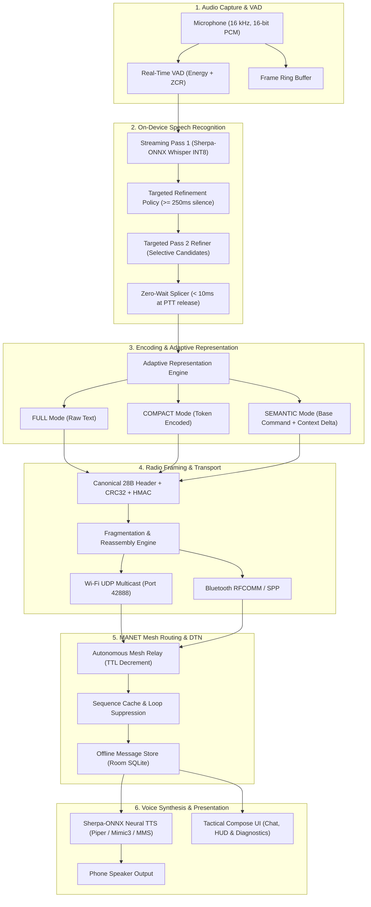

# System Architecture — iTantra

**Project:** iTantra (Ad Astra)  
**Smart India Hackathon 2026** • **Problem Statement:** SIH26173  

---

## 1. Overview & Architectural Principle

In off-grid tactical operations, disaster relief zones, and remote search-and-rescue missions, cellular and internet infrastructure is frequently unavailable or degraded. Conventional digital voice systems attempt to stream raw digital audio (such as 16 kHz 16-bit PCM, requiring ~32,000 bytes per second), which quickly congests narrow radio channels and leads to high packet loss.

**iTantra** implements a neural transceiver architecture designed to operate over bandwidth-constrained wireless channels by shifting from streaming audio over the air to **on-device speech recognition, compact binary packet transmission, and local neural voice reconstruction**:

```
[Speaker Voice]
       │
       ▼
[On-Device VAD & Whisper STT]
       │
       ▼
[Adaptive Representation & Framing]  ───►  46–170 Byte Radio Packets
       │
       ▼
[Off-Grid Wireless Mesh (Wi-Fi/BT)]
       │
       ▼
[Multi-Hop Forwarding / Relay]
       │
       ▼
[Packet Verification & Display]
       │
       ▼
[On-Device Neural TTS Output]
       │
       ▼
[Audible Speech to Recipient]
```

---

## 2. Core Functional Layers



---

## 3. Detailed Component Breakdown

### 3.1 Audio Capture & Voice Activity Detection (VAD)
- **Audio Format:** 16 kHz sample rate, 16-bit mono PCM.
- **VAD Algorithm:** Short-time energy thresholding combined with Zero-Crossing Rate (ZCR) analysis.
- **Silence Window Tracking:** Tracks consecutive non-speech frames to detect natural pauses ($\ge 250\text{ ms}$) and final speech endpoints.

### 3.2 Speech-to-Text (STT) Engine
- **Engine:** Sherpa-ONNX wrapping ONNX Runtime with quantized INT8 weights.
- **Model:** Multilingual Whisper-Tiny (`tiny-encoder.int8.onnx`, `tiny-decoder.int8.onnx`, `tiny-tokens.txt`).
- **Memory Footprint:** ~103.5 MB total on-device storage.
- **Inference Mode:** Runs locally via native JNI libraries on CPU/NPU without cloud dependencies.

### 3.3 Two-Pass Pipelined Speech Architecture
To prevent noticeable processing delays after an operator finishes speaking:
1. **Pass 1 (Streaming Hypothesis):** Continuously decodes audio frames during speech, producing preliminary tokens.
2. **Silence-Window Refinement:** When the speaker pauses for $\ge 250\text{ ms}$, the system evaluates high-value candidate tokens (emergency keywords, numbers, grid coordinates) and refines them during the pause.
3. **Zero-Wait Finalization:** When the Push-to-Talk (PTT) button is released, in-flight background tasks cancel immediately, completed refinements splice into the final transcript, and the packet is handed to the transmission layer in $< 10\text{ ms}$.

### 3.4 Adaptive Representation Engine
Dynamically adjusts message size based on channel state and confidence:
- **FULL:** Transmits complete UTF-8 text transcript (~90–170 bytes wire footprint).
- **COMPACT:** Transmits compressed tokens (~70–110 bytes wire footprint).
- **SEMANTIC_BASE:** Transmits recognized structured emergency commands (e.g. distress type, severity, sector) in an 8-byte payload (48 bytes wire footprint).
- **CONTEXT_DELTA:** Transmits incremental updates to established tactical context using bitmasked 6–7 byte payloads (46–47 bytes wire footprint).

### 3.5 Radio Framing & Integrity
Every radio packet adheres to a fixed 28-byte canonical header:
```
+---------------+---------------+---------------+---------------+
| Magic (2B)    | Version (1B)  | MsgType (1B)  | Priority (1B) |
+---------------+---------------+---------------+---------------+
| Flags (1B)    | SeqNum (2B)   | Timestamp (8B)| SourceID (4B) |
+---------------+---------------+---------------+---------------+
| DestID (4B)   | LangID (1B)   | PayloadLen(2B)| Payload (N B) |
+---------------+---------------+---------------+---------------+
| CRC32 (4B)    | [Optional HMAC-SHA256 Auth (12B)]             |
+---------------+---------------+---------------+---------------+
```
- **Error Detection:** CRC-32 computed over header and payload.
- **Authenticity:** Optional HMAC-SHA256 signature for anti-tampering verification.
- **Fragmentation:** Messages exceeding maximum transmission unit (MTU) are sliced into numbered fragments and reassembled with duplicate rejection.

### 3.6 Transport Layer & Mesh Forwarding
- **Wi-Fi Transport:** UDP broadcast and multicast on port `42888`.
- **Bluetooth Transport:** Bluetooth Classic RFCOMM / Serial Port Profile (SPP) point-to-point connections.
- **MANET Routing Style:** Application-layer store-and-forward relay. When a node receives a broadcast packet not addressed solely to itself, it decrements the Time-To-Live (TTL), checks its sequence cache to prevent forwarding loops, and rebroadcasts.

### 3.7 Text-to-Speech (TTS) Engine
- **Engine:** Sherpa-ONNX VITS acoustic models.
- **Models:** Piper VITS (English, Hindi, Marathi, Malayalam, Telugu, Bengali), Mimic3 (Gujarati), and Meta MMS (Kannada, Tamil, Odia).
- **Fallback:** If an optional large MMS voice model is omitted during a custom build, the app automatically falls back to the native Android system TTS engine.

---

## 4. Implementation Status Classification

| Layer / Component | Status | Details |
|---|:---:|---|
| On-Device Whisper-Tiny STT | **IMPLEMENTED & VERIFIED** | Validated across 9 Indian languages + English |
| On-Device VITS TTS (Piper / Mimic3) | **IMPLEMENTED & VERIFIED** | Validated offline synthesis for 7 languages in-repo |
| Meta MMS TTS (Kannada, Tamil, Odia) | **IMPLEMENTED & VERIFIED** | Tested with standalone ONNX weights + system fallback |
| Two-Pass Speech Pipeline | **IMPLEMENTED & VERIFIED** | Streaming Pass 1 + silence-window refinement |
| Adaptive Representation (Full / Compact / Semantic) | **IMPLEMENTED & VERIFIED** | Tested with VBR network policy and confidence thresholds |
| Shared Context & Context Delta | **IMPLEMENTED & VERIFIED** | 6–7 byte delta updates with standalone fallback |
| Wi-Fi UDP Multicast Transport | **IMPLEMENTED & VERIFIED** | Port 42888 broadcast tested across physical phones |
| Bluetooth RFCOMM / SPP Transport | **IMPLEMENTED & VERIFIED** | Point-to-point serial communication tested |
| BLE Discovery Helper | **PROTOTYPE** | Basic peer advertisement / scan helpers |
| Application-Layer Mesh Relay | **IMPLEMENTED & VERIFIED** | TTL decrement and duplicate sequence suppression |
| Room SQLite Message & Contact Store | **IMPLEMENTED & VERIFIED** | Message history, retention policy, and delivery states |
| Hardware SDR / External LoRa Modules (SX1262 / ESP32-S3) | **FUTURE EXTENSION** | External transceiver hardware interface planned |
| Wi-Fi Channel State Sensing | **FUTURE EXTENSION** | Physical RF link sensing planned for future releases |
