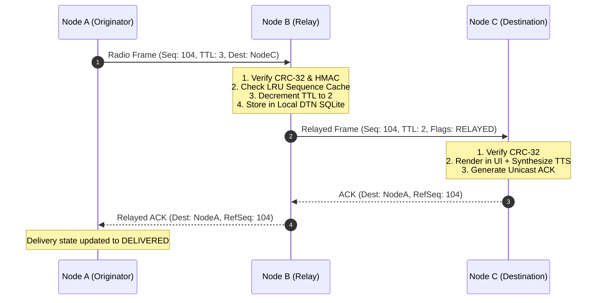

# Radio Framing & MANET Protocol Specification — iTantra

**Project:** iTantra (Ad Astra)  
**Smart India Hackathon 2026** • **Problem Statement:** SIH26173  

---

## 1. Protocol Overview

iTantra uses a compact, deterministic binary packet format designed for low-bandwidth, high-loss ad-hoc wireless links (Wi-Fi UDP Multicast, Bluetooth SPP/RFCOMM, and external sub-GHz radio links). 

All multi-byte integers are serialized in **Big-Endian (Network Byte Order)**.

---

## 2. Canonical Packet Structure

A complete iTantra radio frame consists of a **28-byte canonical header**, a **variable-length payload** (0–512 bytes), a **4-byte CRC-32** checksum, and an **optional 12-byte HMAC-SHA256** authentication tag.

```
 0                   1                   2                   3
 0 1 2 3 4 5 6 7 8 9 0 1 2 3 4 5 6 7 8 9 0 1 2 3 4 5 6 7 8 9 0 1
+-+-+-+-+-+-+-+-+-+-+-+-+-+-+-+-+-+-+-+-+-+-+-+-+-+-+-+-+-+-+-+-+
|          Magic (0x5441)       |    Version    |    MsgType    |
+-+-+-+-+-+-+-+-+-+-+-+-+-+-+-+-+-+-+-+-+-+-+-+-+-+-+-+-+-+-+-+-+
|    Priority   |     Flags     |        Sequence Number        |
+-+-+-+-+-+-+-+-+-+-+-+-+-+-+-+-+-+-+-+-+-+-+-+-+-+-+-+-+-+-+-+-+
|                                                               |
+                       Timestamp (64-bit)                      +
|                                                               |
+-+-+-+-+-+-+-+-+-+-+-+-+-+-+-+-+-+-+-+-+-+-+-+-+-+-+-+-+-+-+-+-+
|                       Source Node ID                          |
+-+-+-+-+-+-+-+-+-+-+-+-+-+-+-+-+-+-+-+-+-+-+-+-+-+-+-+-+-+-+-+-+
|                    Destination Node ID                        |
+-+-+-+-+-+-+-+-+-+-+-+-+-+-+-+-+-+-+-+-+-+-+-+-+-+-+-+-+-+-+-+-+
|    LangID     |         Payload Length        | Payload...    |
+-+-+-+-+-+-+-+-+-+-+-+-+-+-+-+-+-+-+-+-+-+-+-+-+-+-+-+-+-+-+-+-+
| ...Payload (cont)                             |    CRC-32...  |
+-+-+-+-+-+-+-+-+-+-+-+-+-+-+-+-+-+-+-+-+-+-+-+-+-+-+-+-+-+-+-+-+
| ...(cont)     |    [Optional HMAC-SHA256 Auth Tag (12B)]      |
+-+-+-+-+-+-+-+-+-+-+-+-+-+-+-+-+-+-+-+-+-+-+-+-+-+-+-+-+-+-+-+-+
```

---

## 3. Header Field Definitions

| Offset | Field | Size | Description |
|---|---|---|---|
| `0x00` | `Magic` | 2 Bytes | Protocol identifier: `0x54 0x41` (ASCII `"TA"` for Tantra) |
| `0x02` | `Version` | 1 Byte | Protocol version: `0x01` |
| `0x03` | `MsgType` | 1 Byte | Message type enum (see Section 4) |
| `0x04` | `Priority` | 1 Byte | `0x00` = ROUTINE, `0x01` = PRIORITY, `0x02` = EMERGENCY |
| `0x05` | `Flags` | 1 Byte | Bitmask flags (see Section 5) |
| `0x06` | `SeqNum` | 2 Bytes | Monotonically increasing sequence number per node (`0x0000`–`0xFFFF`) |
| `0x08` | `Timestamp` | 8 Bytes | 64-bit Unix epoch millisecond timestamp |
| `0x10` | `SourceID` | 4 Bytes | 32-bit unique identifier of transmitting node |
| `0x14` | `DestID` | 4 Bytes | 32-bit unique recipient ID (`0xFFFFFFFF` = Broadcast) |
| `0x18` | `LangID` | 1 Byte | Indic language code (`0`=EN, `1`=HI, `2`=MR, `3`=GU, `4`=TA, `5`=TE, `6`=KN, `7`=ML, `8`=BN, `9`=OR) |
| `0x19` | `PayloadLen`| 2 Bytes | Unsigned length of the payload body in bytes ($N$) |
| `0x1B` | `Payload` | $N$ Bytes | Variable payload data |
| End | `CRC32` | 4 Bytes | IEEE 802.3 32-bit Cyclic Redundancy Check across header + payload |
| End + 4| `HMAC` | 12 Bytes | Optional truncated HMAC-SHA256 authentication tag (if `FLAG_HMAC` is set) |

---

## 4. Message Types (`MsgType`)

```
0x01: FULL_VOICE_TEXT     — Raw UTF-8 transcript (90–170 bytes)
0x02: COMPACT_VOICE       — Token-compressed representation (70–110 bytes)
0x03: SEMANTIC_BASE       — Structured tactical emergency command (8 bytes)
0x04: CONTEXT_DELTA       — Differential state update (6–7 bytes)
0x05: SEMANTIC_ENHANCE    — Optional descriptive extension for semantic base
0x10: HEARTBEAT           — Periodic node presence announcement
0x11: ACK                 — Unicast delivery confirmation
0x12: ROUTE_DISCOVERY     — Neighbor and link quality announcement
0x13: CONTEXT_SYNC_REQ    — Context resynchronization request
```

---

## 5. Packet Flags Bitmask

```
Bit 0 (0x01): ACK_REQUESTED      — Recipient must reply with an ACK frame
Bit 1 (0x02): IS_FRAGMENT        — Payload is part of a fragmented message
Bit 2 (0x04): RETRANSMISSION     — Duplicate frame re-sent after timeout
Bit 3 (0x08): HMAC_PRESENT       — Packet includes trailing 12-byte HMAC tag
Bit 4 (0x10): RELAYED            — Packet has been forwarded by at least one mesh hop
Bit 5–7:      RESERVED           — Reserved for future protocol extensions
```

---

## 6. Adaptive Representation Payload Formats

### 6.1 `SEMANTIC_BASE` (8 Bytes Payload)
Fixed-layout binary encoding for high-priority tactical messages:
```
Byte 0: Command ID (0x01=MEDEVAC, 0x02=FIRE_SUPPORT, 0x03=AMBUSH, 0x04=STATUS_REPORT)
Byte 1: Severity Level (1–5)
Byte 2: Sector / Grid Area ID (0–255)
Byte 3–4: Latitude Delta / Encoded Coordinate 1 (int16)
Byte 5–6: Longitude Delta / Encoded Coordinate 2 (int16)
Byte 7: Casualty / Asset Count & Status Bitmask
```
*Total wire footprint: 28B Header + 8B Payload + 4B CRC = **40 Bytes** (48B with HMAC).*

### 6.2 `CONTEXT_DELTA` (6–7 Bytes Payload)
Differential updates applied against previously acknowledged shared context:
```
Byte 0: Context ID (8-bit reference to active mission session)
Byte 1: Update Mask (Bit 0: Status, Bit 1: Location, Bit 2: Urgency, Bit 3: Count)
Byte 2–3: Field A update value (e.g. new Grid Offset)
Byte 4–5: Field B update value (e.g. updated Asset Code)
[Byte 6]: Optional checksum byte
```
*Total wire footprint: 28B Header + 6B Payload + 4B CRC = **38 Bytes** (46B with HMAC).*

---

## 7. Reliability & MANET Mesh Forwarding



### 7.1 Loop Suppression & De-duplication
Each mesh node maintains an in-memory Least Recently Used (LRU) sequence cache keyed by `(SourceID, SeqNum)`. Duplicate packets arriving from alternate paths or echo reflections are discarded in $\mathcal{O}(1)$ time without re-forwarding.

### 7.2 Delay-Tolerant Networking (DTN)
When next-hop neighbors are out of radio range, outgoing frames are queued in local SQLite persistence. When link discovery detects a returning or newly available node, queued frames are dispatched automatically.
